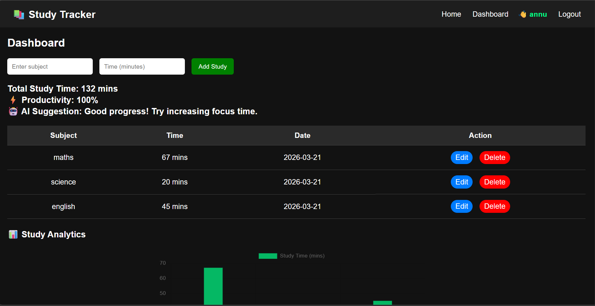

# 🚀 AI Study Tracker

An AI-powered Study Tracker web app built using Flask that helps users track study time, analyze productivity, and get smart suggestions.

---

## 🌐 Live Demo
👉 https://ai-study-tracker-2.onrender.com

---

## 📸 Screenshot

---

## ✨ Features

- 📚 Add and track daily study sessions
- 📊 Visualize study data using bar charts
- ⚡ AI-based productivity suggestions
- 🔐 User authentication (Login / Signup)
- 🗑️ Edit and delete study records
- 📱 Fully responsive (Mobile-friendly UI)

---

## 🧠 AI Feature

The app analyzes total study time and gives suggestions like:

- Low study → "Focus more on consistency"
- Medium → "Good progress, increase focus time"
- High → "Excellent work, maintain consistency"

---

## 🛠️ Tech Stack

- **Backend:** Python, Flask
- **Frontend:** HTML, CSS, JavaScript
- **Database:** SQLite
- **Charts:** Chart.js
- **Deployment:** Render

